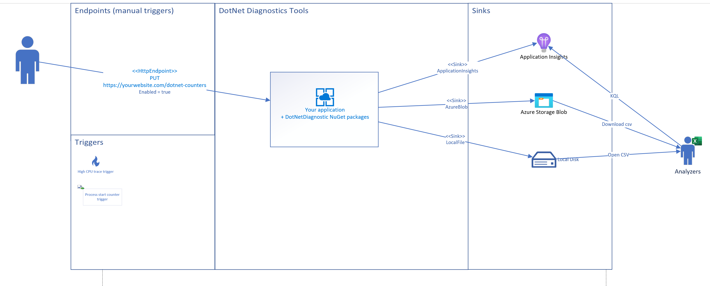
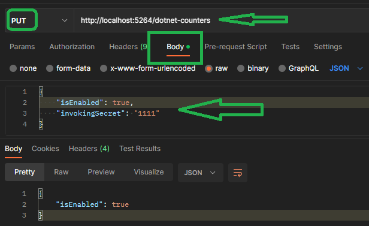
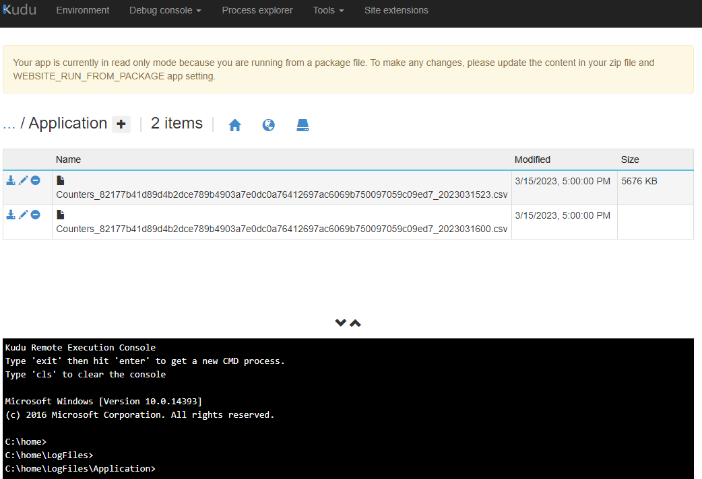
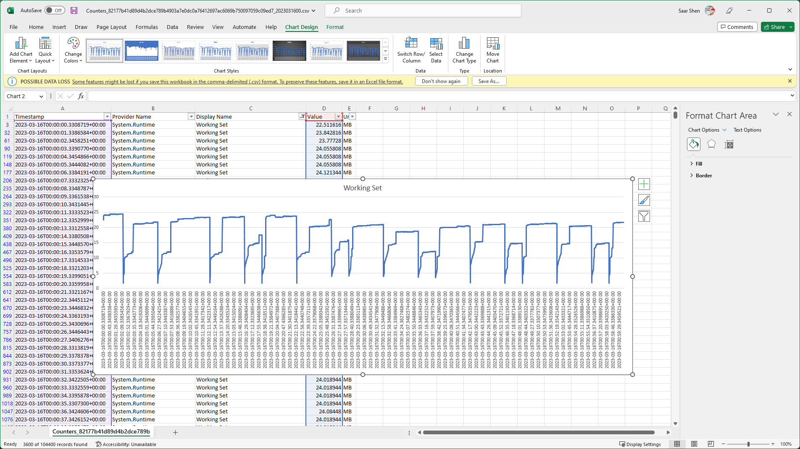

# Welcome to Open DotNET Diagnostics

Integrate .NET diagnostics tools into your code and seamlessly deliver results to multiple destinations.



_Please note that while this repository is open source, it is not a Microsoft/dotnet repository. We welcome contributions from anyone interested in improving our solution._

Our approach prioritizes the developer experience and therefore requires some code instrumentation, typically just a few lines. If you prefer an operational approach that doesn't require any code changes, we recommend checking out the official [dotnet-monitor](https://github.com/dotnet/dotnet-monitor) repository.

## Get Started (dotnet-counters)

Assuming you have an ASP.NET Core WebAPI project:

1. Add NuGet packages:
    * [OpenDotNetDiagnostics.Counters.WebEndpoints](https://www.nuget.org/packages/OpenDotNetDiagnostics.Counters.WebEndpoints) - to expose an endpoint for enabling/disabling `dotnet-counters`.
    * [OpenDotNetDiagnostics.Counters.Sinks.LocalFile](https://www.nuget.org/packages/OpenDotNetDiagnostics.Counters.Sinks.LocalFile) - to export the data to a local file (and in app service, to application logs folder).

2. Instrument the code to register the proper service and map the end point, for example:

    ```csharp
    var builder = WebApplication.CreateBuilder(args);

    // Register `dotnet-counters` service and its sink.
    builder.Services.AddDotNetCounters()
        .WithLocalFileSink()
        .Register();

    var app = builder.Build();

    app.MapGet("/", () => "Hello World!");
    
    // Add an endpoint of `/dotnet-counters`
    app.MapDotNetCounters("/dotnet-counters");
    app.Run();
    ```

    Other sinks, for example, Azure Blob or Application Insights are also supported. See [wiki](https://github.com/xiaomi7732/DotNetDiagnostics/wiki#sinks) for more details.

3. Optionally, customize the settings, for example, you could specify a invoking secret than the default of `1123` by putting this in your [appsettings.json](./examples/WebAPIExample/appsettings.Development.json):

    ```json
    "DotNetCounters": {
        "InvokingSecret": "1111"
    },
    ```

4. Run your app.

5. To enable `dotnet-counters`, invoke a `HttpPUT` on the endpoint, for example:

    

    _Tips: You can turn off `dotnet-counters` at anytime by invoke another PUT request with `isEnabled` parameter set to false._

1. Get the output
    * In a local environment, by default, the file is in `%tmp%`, you will have files like `Counters_2023031600.csv`;
    * In `Azure App Service`, the default output path would be `%HOME%/LogFiles/Application/`, and the file name would carry a unique id for the service instance, like this:
        * Counters_82177b41d89d4b2dce789b4903a7e0dc0a76412697ac6069b750097059c09ed7_2023031523.csv
        

1. And you shall be able to download analysis the result in tools you already familiar with, for example, in the Excel:

    

    What we see: it is a pretty small amount of `working set` used over the period, yet we could still see dips, probably GC?

## Scenarios

* [Basic settings of the pipeline and the customizations](./examples/WebAPIExample/)
* [Enable `dotnet-counters` for CPU usage monitoring](./examples/CPUIntensiveApp/)

For more, read the [wiki](https://github.com/xiaomi7732/DotNetDiagnostics/wiki).

## Vision

We aim to alleviate the following **pain points**:

1. You no longer need to deliver dotnet diagnostic tool binaries such as dotnet-counters, dotnet-trace, or dotnet-dump to your environment..
   1. Some environments, such as containers, make it inconvenient to add additional binaries, while others, like Azure App Service/WebSite, are sandboxed and unable to run .NET tools.
   2. With our solution, you can enjoy a consistent experience whether you are diagnosing issues locally or remotely.

2. You no longer need to export diagnostic data, such as `dotnet-counter` output, from a constrained environment.
    1. By adding proper sinks, you can easily access these files through Kudu or Azure Blob Storage and so on.
    2. Your data will persist externally even if your machine or containers are recycled.

3. With our solution, you can write once and run everywhere, including locally, on Azure WebSite, in containers, or on AKS, with a unified experience.


## Road map

1. Add support for more .NET diagnostics tools.
1. Update to support more complex environments - scaled out multiple instances.
1. Support triggers - that automatically starts the diagnostic tools.
1. Add guidance for extending sinks.

## Recommended Setup Matrix

| DotNet Tools                                                                                                     | Local Environment                                                                                                                                                                                                                                                 | Azure App Service                                                                                                                                                                                                                                                                                                                                                                                    | Container                                                                                                                                                                                                                                                         | Remarks     |
| ---------------------------------------------------------------------------------------------------------------- | ----------------------------------------------------------------------------------------------------------------------------------------------------------------------------------------------------------------------------------------------------------------- | ---------------------------------------------------------------------------------------------------------------------------------------------------------------------------------------------------------------------------------------------------------------------------------------------------------------------------------------------------------------------------------------------------- | ----------------------------------------------------------------------------------------------------------------------------------------------------------------------------------------------------------------------------------------------------------------- | ----------- |
| [dotnet-counters](https://github.com/dotnet/diagnostics/blob/main/documentation/dotnet-counters-instructions.md) | [OpenDotNetDiagnostics.Counters.WebEndpoints](https://www.nuget.org/packages/OpenDotNetDiagnostics.Counters.WebEndpoints) +<br /> [OpenDotNetDiagnostics.Counters.Sinks.LocalFile](https://www.nuget.org/packages/OpenDotNetDiagnostics.Counters.Sinks.LocalFile) | [OpenDotNetDiagnostics.Counters.WebEndpoints](https://www.nuget.org/packages/OpenDotNetDiagnostics.Counters.WebEndpoints) +<br /> [OpenDotNetDiagnostics.Counters.Sinks.LocalFile](https://www.nuget.org/packages/OpenDotNetDiagnostics.Counters.Sinks.LocalFile) or [OpenDotNetDiagnostics.Counters.Sinks.AzureBlob](https://www.nuget.org/packages/OpenDotNetDiagnostics.Counters.Sinks.AzureBlob) | [OpenDotNetDiagnostics.Counters.WebEndpoints](https://www.nuget.org/packages/OpenDotNetDiagnostics.Counters.WebEndpoints) +<br /> [OpenDotNetDiagnostics.Counters.Sinks.AzureBlob](https://www.nuget.org/packages/OpenDotNetDiagnostics.Counters.Sinks.AzureBlob) | MVP         |
| [dotnet-dump](https://github.com/dotnet/diagnostics/blob/main/documentation/dotnet-dump-instructions.md)     | Planning                                                                                                                                                                                                                                                          | Planning                                                                                                                                                                                                                                                                                                                                                                                             | Planning                                                                                                                                                                                                                                                          | Coming next |
| [dotnet-trace](https://github.com/dotnet/diagnostics/blob/main/documentation/dotnet-trace-instructions.md)       | Planning                                                                                                                                                                                                                                                          | Planning                                                                                                                                                                                                                                                                                                                                                                                             | Planning                                                                                                                                                                                                                                                          | Backlog     |

There are quite a few to crewing through. Please feel free to contact if want to contribute.

* Core projects
    * Core - fundamental utilities, data contracts, abstractions.
    * Counters - `dotnet-counters` specific implementations.

* Endpoints
    * dotnet-counters
        * WebEndpoints - expose dotnet-counters as a WebAPI endpoint. Default to `PUT /dotnet-counters`.

* Sinks
    * dotnet-counters
        * Local file - beta, outputs data to local file.
        * Azure Blob - beta, outputs data to Azure Storage for easy access.
        * Application insights - beta, outputs data to Application Insights for powerful query.
