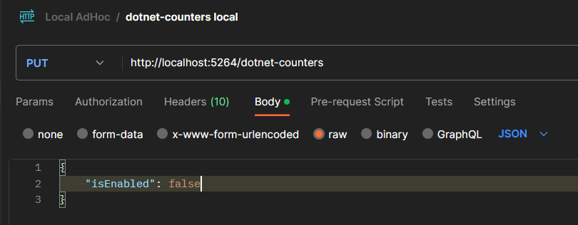

# Welcome to Open DotNET Diagnostics

Our vision:

Integrate .NET diagnostics tools into your code and seamlessly deliver results to multiple destinations.


We address the following **pain points**:

1. You don't need to deliver dotnet diagnostic tool binaries (like dotnet-counters, dotnet-trace, dotnet-gcdump) to the environment.
   1. There are environment like containers that it is not convenient to get additional binaries;
   2. There are hosted environment like Azure App Service/WebSite, which is sandboxed, that you can't run .NET tools.
   3. It's going to be consistent experience for local or remote diagnosing.

1. You don't need to export the diagnostic data, `dotnet-counter` output for example, out of the constraint environment.
    1. By adding proper sinks, you could easily access those files - through Kudu or from Azure Blob Storage ...
    2. Your machine/containers might be recycled, data will be persistent externally.

1. Write it once, run it everywhere - local, Azure WebSite, Container, AKS, etc, with unified experience.

_Notes: This repository is open source, but it is NOT a Microsoft/dotnet repository. Contributions are welcome!_

This approach leans more toward developer experience, and a reasonable code instrumentation is required. If you are looking for an operational (code-less) approach, check out the official [dotnet-monitor](https://github.com/dotnet/dotnet-monitor) repository.

## Get Started (dotnet-counters)

Assuming you have an Azure WebAPI:

1. Add NuGet packages:
    1. For example, for `dotnet-counter`, use the following packages:
        * DotNet.Diagnostics.Counters.WebHooks - to expose an endpoint for enabling/disabling `dotnet-counters`.
        * DotNet.Diagnostics.Counters.Sinks.LocalFile - to export the data to a local file (and in app service, to public application Logs folder).

1. Instrument the code to register the proper service and map the end point, for example:

    ```csharp
    var builder = WebApplication.CreateBuilder(args);

    // Add services needed to run dotnet-counters
    builder.Services.AddDotNetCounters();
    // Add services needed for the local file sink for dotnet-counters
    builder.Services.AddDotNetCounterLocalFileSink();

    var app = builder.Build();

    app.MapGet("/", () => "Hello World!");
    
    // Add an endpoint of `/dotnet-counters`
    app.MapDotNetCounters("/dotnet-counters");
    app.Run();
    ```

1. Optionally, customize the settings, for example, you could specify a invoking secret than the default of `1123` by putting this in your [appsettings.json](./examples/WebAPIExample/appsettings.Development.json):

    ```json
    "DotNetCountersWebhook": {
        "InvokingSecret": "1111"
    },
    ```

1. Run your app.

1. To enable `dotnet-counters`, invoke a `HttpPUT` on the endpoint, for example:

    


1. Get the output
    * On a local environment, by default, the file is in `%tmp%`, you will have files like `Counters_2023031600.csv`;
    * On Azure App Service, the default output path would be `%HOME%/LogFiles/Application/`, and the file name would carry a unique id for the service instance, like this:
        * Counters_82177b41d89d4b2dce789b4903a7e0dc0a76412697ac6069b750097059c09ed7_2023031523.csv
        

1. And you shall be able to download analysis the result in tools you already familiar with, for example, in the Excel:

    

    It is a pretty small amount of working set used over the period, yet we could still see dips, probably GC?

## Road map

1. Add support for more .NET diagnostics tools.
1. Update to support more complex environments - scaled out multiple instances.
1. Support triggers - that automatically starts the diagnostic tools.
