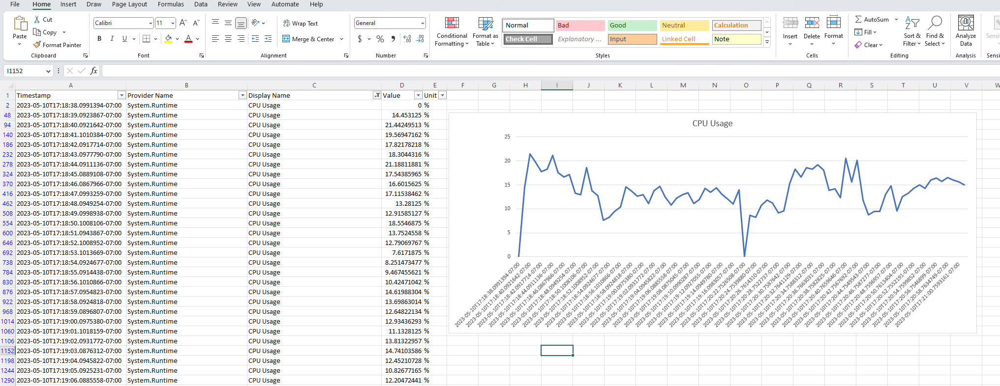

# Monitor CPU Usage by dotnet-counters

`dotnet-counters` is good at monitoring the system continuously for metrics like CPU usage, thread queue and so on. In this example, we will use it to monitor CPU usage.

## Result

Check out [Counters_2023051100.xlsx](./results/Counters_2023051100.xlsx) for a result. It looks like this:



As we can see, there's a constant level of CPU usage captured by `dotnet-counters`.

## Prepare

To get the result by yourself, start by cloning this repo and navigate to `/examples/CPUIntensiveApp`.

## Add NuGet Packages and register the services

1. To form up a pipeline, add the following NuGet packages:

    ```shell
    dotnet add package OpenDotNetDiagnostics.Counters.WebEndpoints --version 1.0.0-beta4
    ```

    And register the service, in [Program.cs](./Program.cs):

    ```csharp
    builder.Services.AddDotNetCounters()
        .Register();
    ```

1. We will then need to expose an endpoint to enable/disable `dotnet-counters`. For example, we want to expose it at `/dotnet-counters`:

    ```csharp
    app.MapDotNetCounters("/dotnet-counters");
    ```

1. We also want to write the output to a local file (we will talk about save it to other places). To do that, add a file sink:

    ```shell
    dotnet add package OpenDotNetDiagnostics.Counters.Sinks.LocalFile --version 1.0.0-beta4
    ```

    And then register the service:

    ```csharp
    builder.Services.AddDotNetCounters()
        .WithLocalFileSink()    // Output to a local file to the default path.
        .Register();
    ```

## Run the application

* Run the application by:

    ```shell
    examples\CPUIntensiveApp> dotnet run
    ```

* You will see logs like this, the app will be hosted on port `5113`:

    ```shell
    info: DotNet.Diagnostics.Counters.DotNetCountersClient[0]
      There are 1 output sinks configured.                              # 1 output sink for dotnet counter
    info: DotNet.Diagnostics.Counters.WebEndpoints.DotNetCounterMiddleware[0]
        No job dispatcher configured. Fits best for single instance environment.    # It is okay for now.
    info: DotNet.Diagnostics.Core.SinkBackgroundService[0]
        Start sink background service
    info: Microsoft.Hosting.Lifetime[14]
        Now listening on: http://localhost:5113
    info: Microsoft.Hosting.Lifetime[0]
        Application started. Press Ctrl+C to shut down.
    info: Microsoft.Hosting.Lifetime[0]
        Hosting environment: Development
    info: Microsoft.Hosting.Lifetime[0]
        Content root path: ...\examples\CPUIntensiveApp
    ```

    `dotnet-counters` endpoint is ready to use, but it is not enabled yet. Let's enable it:

* Use `Postman` or any other tools that allows you to invoke RESTful APIs and do a `PUT` like this:

    PUT http://localhost:5113/dotnet-counters with body:

    ```json
    {
        "isEnabled": true,
        "invokingSecret": "1123"
    }
    ```

    Upon success, you will see logs like this:

    ```shell
    info: DotNet.Diagnostics.Counters.DotNetCountersClient[0]
          Enabling dotnet-counters...
    info: DotNet.Diagnostics.Counters.DotNetCountersClient[0]
          dotnet-counters enabled.          # dotnet-counters enabled
    info: DotNet.Diagnostics.Counters.Sinks.LocalFile.LocalFileSink[0]
          Open writing: ...\Temp\Counters_2023051100.csv    # here's the result file
    ```

    Now, use browser to access `http://localhost:5113` to generate some CPU heavy traffic and you will see the metrics of `cpu-usage` go up in the result file.

## Customize invoking secret

`1123` is the default invoking secret. Change it to your own, `mysecret` for example. To do that, update `appsettings.json` by adding:

```json
{
    "DotNetCounters": {
        "InvokingSecret": "mysecret"
    }
}
```

See [appsettings.Development.json](../WebAPIExample/appsettings.Development.json) for a full example. Restart the app and update the body to enable or disable `dotnet-counters`:

```json
{
    "isEnabled": true,
    "invokingSecret": "mysecret"
}
```

And if the secret doesn't match, you will get the following error message in the response:

```json
{
    "statusCode": 403,
    "message": "Unauthorized access. Invalid invoking secret."
}
```

## Output to Azure Storage for remote storage

Output to csv file in local file system is good for debugging, it is not always accessible when the application is deployed to remote environment - Azure App Service, Kubernetes cluster...

// TODO: Add steps

## Output to Application Insights for advanced query

// TODO: Add steps
