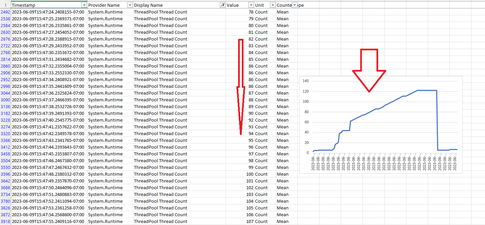
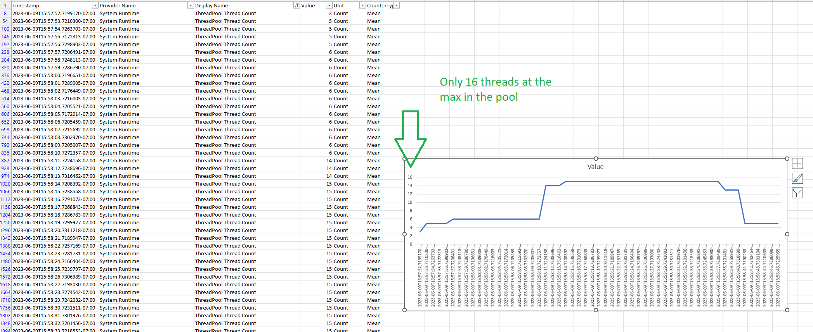

# ThreadPool Starvation Detection Example

.NET runtime is designed only need a few threads in the thread pool for the application to run. However, we, as developers, need to be careful not to request excessive number of threads.

But are we?

`dotnet-counters` is a useful tool to detect thread-pool starvation. In this example, you will learn how to use `OpenDotNetDiagnostics` to diagnose it and to answer that question.

## Low CPU, Low RPS

If your application is running low CPU but still have a low RPS(Request per Second) rate, it probably has been suffering from thread-pool starvation.

For example, if you try to `bombardier` the `/starv` endpoint in this example app, you will see a result similar to this:

```shell
> .\bombardier-windows-amd64.exe http://localhost:5212/starv
Bombarding http://localhost:5212 for 10s using 125 connection(s)
[=================================================================================================================] 10s
Done!
Statistics        Avg      Stdev        Max
  Reqs/sec         1.84      21.85     391.51
  Latency         9.12s      2.38s     10.63s
  HTTP codes:
    1xx - 0, 2xx - 18, 3xx - 0, 4xx - 0, 5xx - 0
    others - 125
  Errors:
    the server closed connection before returning the first response byte. Make sure the server returns 'Connection: close' response header before closing the connection - 125
  Throughput:     3.17KB/s
```

The average RPS is 1.84, well, that is less than 2 requests per second. The latency is really large too.

To put that in perspective, assuming the problem got resolved, by hitting the other endpoint without thread pool starvation:

```shell
> .\bombardier-windows-amd64.exe http://localhost:5212/nostarv
Bombarding http://localhost:5212/nostarv for 10s using 125 connection(s)
[=================================================================================================================] 10s
Done!
Statistics        Avg      Stdev        Max
  Reqs/sec       239.71    1164.01    6734.44
  Latency      510.59ms     2.82ms   585.43ms
  HTTP codes:
    1xx - 0, 2xx - 2500, 3xx - 0, 4xx - 0, 5xx - 0
    others - 0
  Throughput:    55.22KB/s
```

We got around 240 requests per second with the latency around 500ms (that I put [in the code](./Program.cs)).

## Determine if it is thread-pool starvation

There are various ways to check if that's due to a thread-pool starvation. We here will use `dotnet-counters`. To start, add the NuGet packages:

```shell
dotnet add package OpenDotNetDiagnostics.Counters.WebEndpoints --prerelease
dotnet add package OpenDotNetDiagnostics.Counters.Sinks.LocalFile --prerelease
dotnet add package OpenDotNetDiagnostics.Counters.Triggers.ProcessStart --prerelease
```

And configure it that the dotnet-counters will be triggered at the beginning of the application:

```csharp
// Enable dotnet-counters to capture the thread pool starvation
builder.Services.AddDotNetCounters(pipeline =>
{
    pipeline.AddLocalFileSink();
    pipeline.AddProcessStartTrigger();
});

...

// If you want, expose an endpoint for manual operations
app.MapDotNetCounters("/dotnet-counters");
```

_if you cloned the example in this repository, thats already done._

Then, we will start the application, and there will be logs about `dotnet-counters` being started:

```shell
info: DotNet.Diagnostics.Counters.DotNetCountersClient[0]
      There are 2 output sinks configured.
info: DotNet.Diagnostics.Counters.WebEndpoints.DotNetCounterMiddleware[0]
      No job dispatcher configured. Fits best for single instance environment.
info: DotNet.Diagnostics.Core.SinkBackgroundService[0]
      Start sink background service
info: DotNet.Diagnostics.Counters.Triggers.ProcessStartTrigger[0]
      Start dotnet-counters with the process ThreadPoolStarvationExample(21628), delay for 00:00:05
info: Microsoft.Hosting.Lifetime[14]
      Now listening on: http://localhost:5212
info: Microsoft.Hosting.Lifetime[0]
      Application started. Press Ctrl+C to shut down.
...
```

Okay, start another terminal, and invoke the `/starv` endpoint:

```shell
./bombardier-windows-amd64.exe http://localhost:5212/starv
```

Once it is done, you will have a csv file write to `%tmp%` folder of your box, see your logs for the path.

Open it and filter down the `Display Name` to `ThreadPool Thread Count` and if you see:

* Thread count shooting up to 50+ or even 3 digits, and
* For a period, it increased about 1 thread in 1 second

That means, the dotnet runtime is having a hard time to keep up with the threads needed in the pool, thus the starvation.



In comparison, this is how it looks like when there's no starvation:



* The maximum thread count in the pool is only 16, and
* There is no thread count climbing each second

